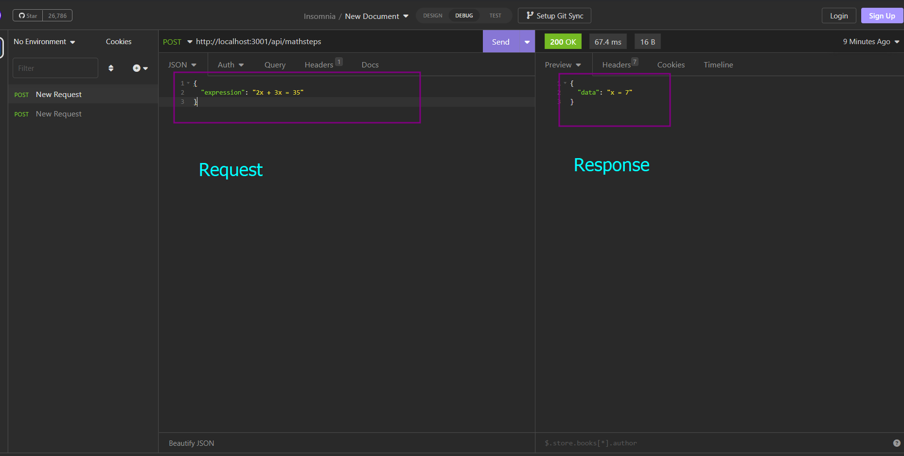
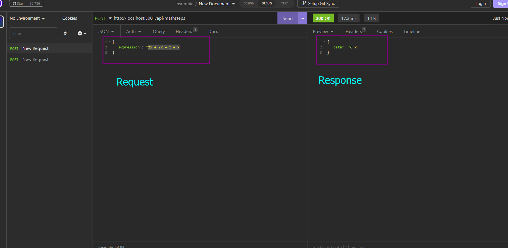

# mathsteps-rest-api
Math Steps https://github.com/google/mathsteps

## Steps to check this app

#### Open Terminal/Windows Powershell/Git Bash and run the following commands -

- git clone git@github.com:govindamandal/mathsteps-rest-api.git
- cd mathsteps-rest-api
- npm install
- npm run dev OR npm start

#### Now open your any rest client and open link - http://localhost:3001/api/mathsteps and send POST request with body parameter expression

### See the attached screenshot to test the API by passing parameter

